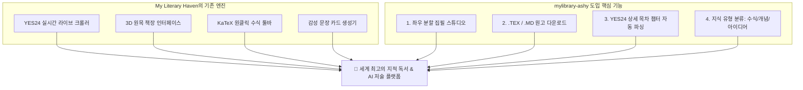

# ✍️ My Intellect Library (mylibrary-ashy) 심층 비교 분석 및 우리 서재 고도화 제안서

> **분석 대상 URL**: [https://mylibrary-ashy.vercel.app/](https://mylibrary-ashy.vercel.app/)  
> **비교 기준 프로그램**: **My Literary Haven (나만의 지적 서재 & 독서 연구실)**  
> **작성 일자**: 2026년 9월 9일  

---

## 1. 개요 및 분석 배경

`https://mylibrary-ashy.vercel.app/`는 **"My Intellect Library - 나의 지식 서재 & AI 집필 연구소"**라는 타이틀로 제작된 Next.js 14 기반의 서재 및 집필 웹 애플리케이션입니다.

배포된 프로덕션 빌드 청크(`page-53b5ae58613d6e18.js`, `page-eceab594b4c6541b.js`, App Router 구조)를 분석한 결과, 이 프로그램은 지금까지 분석했던 서재 중 **가장 완성도 높은 '집필 전용 분할 스튜디오(Draft Studio)'와 'YES24 2단계 심층 목차 수집 파이프라인'**을 갖추고 있었습니다.

본 문서는 `mylibrary-ashy`의 혁신적인 기능들을 면밀히 파헤치고, **우리 서재(My Literary Haven)를 궁극의 독서·저술 통합 플랫폼으로 도약시키기 위한 최우선 벤치마킹 과제**를 정리한 종합 보고서입니다.

---

## 2. 1:1 심층 비교 분석 매트릭스

| 비교 항목 | 타 서재 (`mylibrary-ashy`) | 우리 서재 (`My Literary Haven`) | 비교 평가 및 시사점 |
| :--- | :--- | :--- | :--- |
| **시스템 아키텍처** | Next.js 14 App Router, Tailwind CSS, Lucide, KaTeX | 순수 Vanilla JS (ES6 Module), Modern CSS, Vite, KaTeX | • 타 서재: Next.js 프레임워크 기반<br>• 우리 서재: 가볍고 반응성이 뛰어난 클린 아키텍처 |
| **집필 스튜디오<br>(Draft Studio)** | 🏆 **좌우 분할 스크린(Split Screen) 작업실**<br>• 좌측: 서재의 모든 지식·수식 카드 아카이브<br>• 우측: 마크다운 & LaTeX 원고 집필 에디터<br>• **[원고 본문에 바로 인용 삽입]** 버튼 지원 | ⚠️ **하단 단일 텍스트 에디터 중심**<br>(도서 상세 하단에 에디터가 있으나, 다른 책의 인용구를 좌우에서 바로 보며 꽂아 넣는 분할 뷰 부재) | 💡 **타 서재 압도적 우위 (적극 도입 권장)**<br>독서 메모를 보면서 자신의 책을 집필하는 최고의 인터페이스 구조 |
| **원고 파일 내보내기<br>(Export Format)** | ✅ **[.TEX] & [.MD] 파일 다운로드 지원**<br>(Overleaf/학술 논문 출판용 LaTeX `.tex` 파일 및 마크다운 파일 원클릭 내보내기) | ⚠️ **서재 내부 로컬 저장 중심**<br>(파일 다운로드 버튼 부재) | 💡 **타 서재 우위 (적극 도입 권장)**<br>학술 연구자 및 출판 작가에게 필수적인 킬러 기능 |
| **YES24 목차(TOC) 연동** | ✅ **2단계 심층 스크래핑 파이프라인**<br>• 1단계: 검색 목록 조회<br>• 2단계: 책 선택 시 상세 페이지에서 **공식 목차(제1장, 제2장...) 자동 추출** | ✅ **기본 검색 결과 중심 스크래핑**<br>(도서명, 저자, 역자, 출판사, 초고화질 XL 표지, 정가/할인가 완벽 수집) | 💡 **상세 목차 자동 파싱 기능 융합 권장**<br>우리 크롤러에 상세 페이지 목차 추출 로직을 결합하면 완벽해짐 |
| **지식 카드 유형화** | ✅ **4대 지식 유형 태그 분류**<br>(📐수식/증명, 💡개념, 🚀아이디어, 📝인용구) | ⚠️ **단일 인용구(Quotes) 목록**<br>(페이지 번호와 메모는 있으나 수식/아이디어 유형별 탭 필터링 부재) | 💡 **타 서재 우위 (도입 권장)**<br>집필 시 "수식만 모아보기" 등이 가능해 작업 효율 대폭 향상 |
| **서재 시각화 (Bookshelf)** | ⚠️ **2D 카드 갤러리 뷰만 지원** | ✅ **3D 원목 책장 (Spine 뷰) + 갤러리 + 리스트**<br>(책등 세로 타이틀, 책갈피 리본, 원목 선반) | 🏆 **우리 프로그램 압도적 우위**<br>시각적 감성과 몰입감은 우리가 훨씬 우수함 |
| **독서 감성 & 공유** | ❌ **관련 기능 없음** | ✅ **감성 문장 카드 생성기 (QuoteCardModal)**<br>(원목/미드나잇/페이퍼/노을 테마 카드 생성 및 클립보드 복사) | 🏆 **우리 프로그램 독보적 기능** |
| **독서 통계 및 관리** | ⚠️ **단순 권수 카운트 (보유/읽는중/완독)** | ✅ **종합 통계 대시보드 (StatsModal)**<br>(총 페이지 수, 연간 목표 게이지, 분야별 분포 차트) | 🏆 **우리 프로그램 우위** |

---

## 3. `mylibrary-ashy`의 4대 핵심 킬러 기능 상세 분석

### 1) 🖥️ 좌우 분할 집필 스튜디오 (Split-Screen Draft Studio)
* **특징**: 상단 메뉴의 `/studio`로 진입하면 좌우 2분할의 전문 집필 환경이 펼쳐집니다.
  - **좌측 패널 (`수집된 지식 & 수식 아카이브`)**:
    - 내 서재에 등록된 모든 도서의 인용구, 수학 공식, 집필 아이디어가 카드 형태로 나열됨.
    - 검색창을 통해 "미분방정식", "스펙트럼 정리", "클린코드" 등을 검색하면 관련 도서의 인용 카드만 즉시 필터링.
    - 각 카드 우측 상단에 **`[원고 본문에 바로 인용 삽입]`** 버튼이 위치.
  - **우측 패널 (`원고 집필 에디터`)**:
    - 챕터 제목(예: *제1장: 스펙트럼 정리와 상태 공간의 대칭성*) 입력.
    - 좌측 카드의 삽입 버튼을 누르면 우측 에디터의 커서 위치에 마크다운 인용문(`> "..." — 《도서명》 p.142`)과 수식이 자동으로 꽂힘.
    - 상단 탭에서 `[집필(Write)]`과 `[LaTeX 렌더링(Preview)]`을 실시간 전환.
* **사용자 가치**: 책을 집필할 때 책을 다시 뒤적이거나 별도 메모장을 띄울 필요 없이, **"왼쪽에서 지식을 고르고 오른쪽 원고에 꽂아 넣는" 궁극의 집필 동선**을 완성했습니다.

### 2) 📄 학술용 [.TEX] 및 [.MD] 파일 원클릭 내보내기 (Export Pipeline)
* **특징**: 작성 완료된 원고를 두 가지 포맷으로 즉시 다운로드할 수 있습니다:
  - **[.MD 내보내기]**: 옵시디언(Obsidian), 노션(Notion), 벨로그 등 범용 마크다운 플랫폼에 호환되는 `.md` 파일 다운로드.
  - **[.TEX 내보내기]**: Overleaf, TeXShop 등 전문 학술 조판 툴에서 컴파일할 수 있도록 LaTeX 도큐먼트 클래스 문법(`\documentclass{article}`, `\begin{document}`, `\section{...}`)이 입혀진 `.tex` 파일 다운로드.
* **사용자 가치**: 이공계 대학원생, 교수, 기술서 작가에게 LaTeX 파일 다운로드는 논문 및 단행본 출판으로 직결되는 대체 불가능한 기능입니다.

### 3) 📑 YES24 2단계 심층 스크래핑 (상세 목차/TOC 자동 파싱)
* **특징**:
  - 1단계: `/api/search/yes24?query=선형대수` 호출 ➔ 도서 목록 추출
  - 2단계: 사용자가 특정 책을 클릭하면 `/api/search/yes24?goodsNo=17976995` 호출 ➔ YES24 상품 상세 페이지의 `<div id="infoset_toc">`를 스크래핑하여 **"제1장 벡터공간과 기저", "제2장 선형사상과 행렬 표현"... 등의 목차를 배열로 자동 파싱**하여 책 데이터에 저장.
* **사용자 가치**: 사용자가 일일이 책의 목차를 타이핑할 필요 없이, YES24에 등록된 수십 개의 챕터 정보가 서재 상세 페이지에 자동으로 정리되어 들어옵니다.

### 4) 🏷️ 4대 지식 유형 태그 분류 시스템
* **특징**: 책을 읽으며 기록하는 지식을 4가지 목적별로 분류합니다:
  - 📐 **수식 (proof)**: 수학적 증명, 공학 수식 모델
  - 💡 **개념 (concept)**: 핵심 이론 및 용어 정의
  - 🚀 **아이디어 (idea)**: 내 책이나 프로젝트에 적용할 독창적 발상
  - 📝 **인용구 (quote)**: 저자의 울림 있는 원문 구절
* **사용자 가치**: 집필 스튜디오에서 "수식만 모아보기"를 누르면 책 속의 모든 LaTeX 공식만 일목요연하게 모아볼 수 있어 연구 작업의 효율이 극대화됩니다.

---

## 4. `mylibrary-ashy`의 한계점 (우리 프로그램의 독보적 우위)

1. **서재 시각화 및 감성 부재**:
   - 책장(Bookshelf) 뷰가 아예 없으며, 단순 2D 직사각형 카드 목록만 제공되어 '나만의 서재'라는 시각적 만족감이 떨어집니다.
   - **우리 프로그램은 3D 나무 선반, 세로형 책등 타이틀, 책갈피 리본, 3D 원목 책장 뷰를 보유**하고 있습니다.
2. **독서 감성 문장 카드 생성기 부재**:
   - 우리 서재는 마음에 드는 구절을 엽서 형태로 렌더링하여 SNS에 공유하거나 다운로드할 수 있는 모달(`QuoteCardModal.js`)이 완비되어 있습니다.
3. **독서 통계 분석 미흡**:
   - 타 서재는 권수 카운트 3개(보유/읽는중/완독)에 불과하나, 우리 프로그램은 연간 목표 게이지, 누적 페이지, 장르별 도넛 분포 차트를 제공합니다.

---

## 5. 우리 서재(My Literary Haven) 적용 권장 로드맵 (BEST 4)

`mylibrary-ashy`의 **'분할 집필 스튜디오'**와 **'YES24 상세 목차 자동 파싱'**을 우리 프로그램의 탄탄한 엔진에 결합하면 완벽한 시너지가 발생합니다.



### 💡 [제안 1] 독서 저술실을 '좌우 분할 집필 스튜디오(Draft Studio)'로 고도화
- **구현 계획**: 상단 네비게이션에 **[집필 스튜디오]** 버튼을 추가하거나 도서 상세 하단의 `WritingWorkspaceView`를 모달/전체화면 분할 뷰로 확장.
- **레이아웃**:
  - **좌측**: 내 서재의 모든 인용구/수식 검색 카드 + **`[원고에 인용 삽입 ↵]`** 버튼
  - **우측**: 챕터 제목 입력창 + 마크다운/LaTeX 에디터 + 실시간 수식 렌더링 탭

### 💡 [제안 2] 집필 원고의 [.TEX] 및 [.MD] 원클릭 파일 내보내기
- **구현 계획**: 집필 스튜디오 상단에 두 개의 다운로드 버튼 배치:
  - **`.MD 다운로드`**: 원고 본문을 순수 마크다운 파일로 다운로드.
  - **`.TEX 다운로드`**: 아래와 같은 LaTeX 헤더를 감싸 `.tex` 파일로 다운로드:
    ```latex
    \documentclass[11pt,a4paper]{article}
    \usepackage{amsmath,amssymb}
    \usepackage[utf8]{inputenc}
    \usepackage{kotex}
    \title{원고 제목}
    \author{저자명}
    \begin{document}
    \maketitle
    % 원고 본문 및 LaTeX 수식
    \end{document}
    ```

### 💡 [제안 3] YES24 상품 상세 페이지의 '공식 목차(TOC)' 자동 추출 탑재
- **구현 계획**:
  - 기존 `api/yes24.js`에 도서 상세 조회 로직 추가: 도서 등록 시 해당 도서의 상품 번호(`goodsNo`)를 기반으로 YES24 상품 상세 페이지(`https://www.yes24.com/Product/Goods/${goodsNo}`)의 목차 영역을 스크래핑하여 `toc` 필드에 장/절 목록을 자동 입력.
  - 사용자가 목차를 직접 입력할 필요 없이 자동으로 "제1장...", "제2장..."이 목차 탭에 채워짐.

### 💡 [제안 4] 지식 카드에 4대 유형 태그(📐수식 / 💡개념 / 🚀아이디어 / 📝인용) 도입
- **구현 계획**: `ReadingNotesView.js`에서 문장을 등록할 때 유형 라디오 버튼/드롭다운 추가. 수집된 카드들을 유형별 뱃지로 표시하고 필터링할 수 있도록 지원.

---

## 6. 지금까지 분석한 3개 서재 종합 비교 및 우리 서재의 방향성

| 분석 서재 | 대표 특징 | 우리 서재에 가져올 핵심 가치 |
| :--- | :--- | :--- |
| **1. mylibrary-dbbu** | N회독 누적 세션, 4단계 독서 성찰 프롬프트 | **'반복 독서의 성장 기록'과 '삶을 바꾸는 성찰 질문'** |
| **2. mylibrary-jade** | `myApplication` 내 책 활용 계획, 학술 논점 질문 칩, 다크 스칼라 룩 | **'독서 지식을 내 책의 목차와 1:1 매핑하는 사고방식'** |
| **3. mylibrary-ashy** | 좌우 분할 집필 스튜디오, .TEX 내보내기, YES24 상세 목차 자동 파싱 | **'지식을 왼쪽에 띄우고 오른쪽에 집필하는 전문 작업 환경'** |
| **🏆 My Literary Haven (우리 서재)** | **실제 YES24 라이브 스크래핑 엔진 + 3D 원목 책장 + KaTeX 수식 툴바 + 멀티 AI 캐스케이드 + 감성 문장 카드** | **위 3개 서재의 최고 기획들을 흡수하여 유일무이한 '독서·학술·저술 통합 플랫폼' 완성** |

---
*본 문서는 `g:\내 드라이브\mylibrary\개인서재_mylibrary-ashy_비교분석_및_기능도입제안.md`에 저장되었습니다.*
