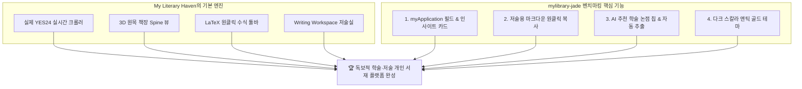

# 🏛️ My Scholar Library (mylibrary-jade) 심층 비교 분석 및 우리 서재 고도화 제안서

> **분석 대상 URL**: [https://mylibrary-jade.vercel.app/](https://mylibrary-jade.vercel.app/)  
> **비교 기준 프로그램**: **My Literary Haven (나만의 지적 서재 & 독서 연구실)**  
> **작성 일자**: 2026년 9월 9일  

---

## 1. 개요 및 분석 배경

`https://mylibrary-jade.vercel.app/`는 **"My Scholar Library - 개인 서재 & 독서 인사이트 워크스페이스"**라는 컨셉으로 제작된 서재 프로그램입니다.

배포된 프로덕션 빌드 번들(`index-BEs-ZrWZ.js`, Tailwind CDN, KaTeX)을 면밀히 역분석한 결과, 이 프로그램은 일반적인 독서 기록 앱을 넘어 **"자신의 책을 집필하거나 학술 연구를 수행하는 연구자·저술가(Scholar & Author)"**를 명확한 타깃으로 삼아 매우 독창적인 기능들을 탑재하고 있었습니다.

본 문서는 `mylibrary-jade`의 핵심 기능과 장단점을 분석하고, **우리 서재 프로그램(My Literary Haven)에 접목하여 최고의 지적 저술 플랫폼으로 도약하기 위한 구체적인 제안**을 정리한 보고서입니다.

---

## 2. 1:1 심층 비교 분석 매트릭스

| 비교 항목 | 타 서재 (`mylibrary-jade`) | 우리 서재 (`My Literary Haven`) | 비교 평가 및 시사점 |
| :--- | :--- | :--- | :--- |
| **핵심 컨셉 및 지향점** | 🎓 **학술 연구자 & 도서 집필자 워크스페이스**<br>("책을 읽고 자신의 책을 쓰는 사람을 위한 서재") | 📚 **지적 개인 서재 & 저술 연구실**<br>("깊이 있는 독서와 수식, AI 토론, 저술이 공존하는 공간") | 두 서재 모두 '지적 독서와 저술'이라는 높은 수준의 공통 지향점을 가짐 |
| **YES24 실시간 연동** | ⚠️ **Google Books / OpenLibrary 중심 & YES24 정적 링크**<br>(실제 YES24 크롤링 엔진 없음) | ✅ **실제 YES24 라이브 스크래핑 & 100% 자동 삽입**<br>(세션 웜업, 고유 GoodsNo, 정가/할인가, 초고화질 XL 표지, 저자/역자 실시간 수집) | 🏆 **우리 프로그램 압도적 우위**<br>실제 한국 도서의 정확한 메타데이터와 표지는 우리가 월등함 |
| **집필 인사이트 관리<br>(Writing Vault)** | ✅ **체계적인 4단계 인사이트 데이터 모델**<br>• `concept` (학술 개념)<br>• `latexFormula` (관련 수식)<br>• `originalQuote` (원문 인용)<br>• `myApplication` (**"내 책 몇 장에 활용할 것인가?"**) | ⚠️ **자유 에세이/초안 에디터 중심**<br>(원문 인용과 집필 초안이 존재하나, 개별 통찰 카드 형태의 체계적 스키마는 미흡) | 💡 **타 서재 우위 (도입 적극 권장)**<br>독서 메모를 "내 책 집필 계획"과 1:1로 직접 매핑하는 뛰어난 아이디어 |
| **저술 도구 연계<br>(Markdown Export)** | ✅ **"저술용 마크다운 복사" 원클릭 지원**<br>(인용문 + 출처 + 내 책 적용 계획 + LaTeX 수식을 옵시디언/노션용 블록으로 복사) | ⚠️ **서재 내 에디터 중심**<br>(외부 저술 툴로의 정돈된 인용 블록 내보내기 버튼 부재) | 💡 **타 서재 우위 (도입 적극 권장)**<br>외부 전문 집필 툴(Obsidian, Overleaf, Notion) 사용자를 위한 필수 기능 |
| **AI 코파일럿 & 토론** | ✅ **Scholar AI & Co-Author 시스템**<br>• 원클릭 **'추천 학술 논점 질문 칩'** 제공<br>• AI 대화에서 **'집필 인사이트 자동 추출'** 버튼 | ✅ **멀티 모델 캐스케이드 (Gemini + OpenAI)**<br>• 3.7 Flash 등 최신 모델 연속 폴백<br>• 오프라인 데모 모드 완비 | 💡 **상호 보완 관계**<br>엔진 구조는 우리가 우수하며, 프롬프트 기획/UX 편의성은 타 서재가 우수 |
| **서재 시각화 (Bookshelf)** | ⚠️ **2D 카드 갤러리 및 통계 요약** | ✅ **3D 원목 책장 (Spine 뷰) + 갤러리 + 리스트**<br>(책등 세로 타이틀, 책갈피 리본, 원목 선반) | 🏆 **우리 프로그램 압도적 우위** |
| **수식 작성 편의성** | ⚠️ **수식 직접 타이핑 필요** | ✅ **원클릭 LaTeX 수식 툴바 (적분, 미분, 급수)** | 🏆 **우리 프로그램 압도적 우위** |
| **비주얼 룩 & 테마** | 🎨 **다크 스칼라 (Deep Stone & Amber Gold)**<br>(Playfair Display, Noto Serif KR, Fira Code) | 🎨 **원목 오크/월넛 & 다크 슬레이트 & 사이버펑크**<br>(Pretendard, Noto Serif KR, Fira Code) | 💡 **타 서재의 앤틱 학술 룩을 우리 테마에 추가 권장** |

---

## 3. 타 서재(`mylibrary-jade`)의 핵심 강점 상세 분석

### 1) 💡 "집필용 인사이트 보관소"와 `myApplication` 필드
* **특징**: 단순한 "인상 깊은 문장" 수집에 그치지 않고, 수집된 지식마다 **"내가 집필할 책에 어떻게 적용할 것인가? (`myApplication`)"**라는 질문을 필수적으로 던집니다.
* **실제 데이터 예시**:
  ```json
  {
    "title": "경사하강법과 순간 기울기의 물리적 해석",
    "concept": "미분과 최적화 알고리즘",
    "latexFormula": "f'(x) = \\lim_{\\Delta x \\to 0} \\frac{f(x+\\Delta x) - f(x)}{\\Delta x}",
    "originalQuote": "변화의 순간을 포착하는 미분이야말로 동적 세계를 이해하는 열쇠다.",
    "sourceChapter": "제2장 변화를 포착하는 순간의 마법",
    "page": 142,
    "myApplication": "집필 중인 도서 [공학 시스템 모델링] 2장 3절의 최적화 알고리즘 도입부 예제로 배치할 예정."
  }
  ```
* **사용자 가치**: 읽은 책의 지식이 머릿속에서 흩어지지 않고, **자신의 저작물(책, 논문, 아티클)의 목차 구조 안으로 즉시 편입**됩니다.

### 2) 📋 "저술용 마크다운 원클릭 복사" (One-Click Academic Markdown Copy)
* **특징**: 인사이트 카드 우측 상단의 복사 아이콘을 누르면, 다음과 같이 정돈된 마크다운 인용 블록이 클립보드에 생성됩니다.
  ```markdown
  > "변화의 순간을 포착하는 미분이야말로 동적 세계를 이해하는 열쇠다."
  > — 《미적분의 쓸모》 (한화택 저), 제2장 p.142
  
  **관련 수식**: $f'(x) = \lim_{\Delta x \to 0} \frac{f(x+\Delta x) - f(x)}{\Delta x}$
  **💡 나의 저술 활용 계획**: 집필 중인 도서 [공학 시스템 모델링] 2장 3절 도입부 예제로 배치할 예정.
  ```
* **사용자 가치**: 옵시디언(Obsidian), 노션(Notion), 오버리프(Overleaf/LaTeX) 등으로 글을 쓰는 저술가들이 글을 쓰다가 즉시 붙여넣을 수 있어 작업 능률이 비약적으로 상승합니다.

### 3) 🎯 AI '추천 학술 논점 질문 칩' (Suggested Discussion Chips)
* **특징**: AI 채팅창 상단에 학술 연구자들이 책을 볼 때 던져야 할 깊이 있는 질문들을 칩 버튼으로 제공합니다:
  - 💬 *"저자의 논증 과정에서 비판적으로 검토하거나 보완할 수 있는 한계점은 무엇인가요?"*
  - 💬 *"내가 쓸 학술/기술 서적의 독창적인 챕터 구성 아이디어를 제안해주세요."*
  - 💬 *"이 책의 핵심 수학 모델을 실무 공학 시스템에 적용할 때 발생할 수 있는 오차는 무엇인가요?"*
* **사용자 가치**: 프롬프트를 어떻게 작성해야 할지 고민할 필요 없이, 클릭 한 번으로 대학원 세미나 수준의 깊이 있는 토론을 즉시 시작할 수 있습니다.

### 4) ⚡ AI 대화에서 "집필 인사이트 자동 추출" (AI to Insight Card)
* **특징**: AI와 대화를 나눈 후 **[💡 집필 인사이트 추출]** 버튼을 누르면, AI가 방금 나눈 대화에서 저술에 쓸 만한 핵심 개념, LaTeX 수식, 원문 인용, 집필 적용점을 JSON으로 자동 파싱하여 `writingInsights`에 바로 카드로 저장해 줍니다.

### 5) 🎨 딥 스톤(#0c0a09) & 앤틱 앰버(#f59e0b) 학술 다크 테마
* **특징**: Playfair Display 영문 세리프 폰트와 묵직한 흑요석(Obsidian/Stone) 배경, 황동빛 앰버 골드 포인트를 사용하여 마치 옥스퍼드 대학교의 고서 도서관에 앉아 있는 듯한 학술적 분위기를 연출합니다.

---

## 4. 타 서재(`mylibrary-jade`)의 한계점 (우리 프로그램의 우위)

1. **YES24 실시간 라이브 크롤링 부재**:
   - `mylibrary-jade`는 YES24 링크만 생성할 뿐, 실제 실시간 YES24 도서 검색 및 표지/가격 추출 엔진이 없습니다.
   - **우리 프로그램은 독보적인 YES24 실시간 라이브 스크래핑 엔진을 통해 실제 YES24의 풍부한 한국어 메타데이터를 100% 가져옵니다.**
2. **3D 원목 책장 시각화 부재**:
   - 타 사이트는 책장 뷰가 없이 단순한 2D 카드 목록만 지원합니다.
3. **LaTeX 수식 작성 툴바의 부재**:
   - 타 사이트는 수식을 전부 손으로 타이핑해야 하지만, **우리 프로그램은 적분, 미분, 시그마 등 수식 버튼을 클릭 한 번으로 삽입하는 툴바가 완비**되어 있습니다.

---

## 5. 우리 프로그램(My Literary Haven) 적용 권장 로드맵 (BEST 4)

타 서재(`mylibrary-jade`)의 "집필자 중심 지적 프레임워크"를 우리 프로그램에 흡수하면 최고의 시너지를 발휘할 수 있습니다.



### 💡 [적용 제안 1] 독서 기록 및 저술 작업실에 `myApplication` 필드 추가
- **구현 내용**: 인상 깊은 문장(Quotes) 및 저술 초안(Drafts) 항목에 **"나의 저술 활용 계획 (내 책 몇 장에 인용할 것인가?)"** 입력 필드를 추가.
- **기대 효과**: 단순 독후감을 넘어, 자신의 책이나 연구 논문을 집필하는 실질적인 '자료 창고'로 기능 확장.

### 💡 [적용 제안 2] "저술용 마크다운 원클릭 복사" 버튼 탑재
- **구현 내용**: 문장 카드 및 저술 아이디어 카드에 **[📋 저술용 마크다운 복사]** 버튼 신설.
- **복사 포맷**:
  ```markdown
  > "{{인용 문장}}"
  > — 《{{도서명}}》 ({{저자}}), {{페이지}}p
  
  **수식**: ${{LaTeX 수식}}$
  **내 저술 반영 메모**: {{myApplication}}
  ```
- **기대 효과**: 노션(Notion), 옵시디언(Obsidian), 벨로그, Overleaf 집필 시 복사 한 번으로 완벽한 인용 블록 생성.

### 💡 [적용 제안 3] AI 심층 토론에 '학술 논점 추천 칩' & '인사이트 자동 추출' 장착
- **구현 내용**:
  1. `AICopilotView.js` 상단에 학술 질문 칩(비판적 한계 검토, 집필 챕터 구성 제안 등) 3~4개 배치.
  2. 대화 완료 후 **[💡 대화 내용을 집필 인사이트로 자동 변환 저장]** 버튼 추가.
- **기대 효과**: 대화창에서 얻은 영감이 휘발되지 않고 해당 책의 집필 노트에 영구 저장됨.

### 💡 [적용 제안 4] '다크 스칼라 (Dark Scholar: 딥 스톤 & 앰버 골드)' 테마 추가
- **구현 내용**:
  - `css/style.css`에 `data-theme="scholar"` 테마 추가.
  - 배경: `#0c0a09` (딥 스톤 블랙), 포인트: `#f59e0b` (앤틱 앰버 골드), 보더: `#292524`.
- **기대 효과**: 밤에 연구하고 책을 읽는 연구자들에게 극상의 가독성과 고급스러운 학술 서재 분위기 제공.

---

## 6. 결론 요약

| 분석 대상 | 종합 평가 및 결론 |
| :--- | :--- |
| **mylibrary-jade** | **"독서에서 집필로 연결되는 파이프라인(Writing Pipeline)"**을 매우 영리하게 구축한 수작. 특히 `myApplication` 필드와 저술용 마크다운 복사, 학술 논점 추천 칩은 저술가들에게 매력적인 킬러 기능임. |
| **My Literary Haven<br>(우리 서재)** | 실제 **YES24 실시간 라이브 스크래핑, 3D 원목 책장, KaTeX 수식 원클릭 툴바, Google Drive 클라우드 백업** 등 핵심 기술 아키텍처에서 압도적으로 앞서 있음. |
| **추천 실행 방향** | 우리의 탄탄한 기술적 우위 위에 `mylibrary-jade`의 **1) myApplication 집필 계획 필드, 2) 저술용 마크다운 복사, 3) AI 학술 질문 칩 및 인사이트 자동 추출**을 이식하면 학술 연구자 및 저술가에게 가장 완벽한 독보적 개인 서재가 될 것입니다. |

---
*본 문서는 `g:\내 드라이브\mylibrary\개인서재_mylibrary-jade_비교분석_및_기능도입제안.md`에 저장되었습니다.*
