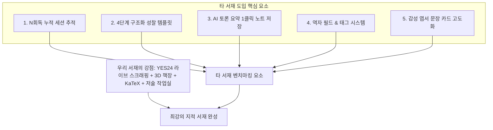

# 📚 타 서재(mylibrary-dbbu) 심층 비교 분석 및 우리 서재 고도화 제안서

> **분석 대상 URL**: [https://mylibrary-dbbu.vercel.app/](https://mylibrary-dbbu.vercel.app/)  
> **비교 기준 프로그램**: **My Literary Haven (나만의 지적 서재 & 독서 연구실)**  
> **작성 일자**: 2026년 9월 9일  

---

## 1. 개요 및 분석 배경

타 서재 프로그램(`mylibrary-dbbu`)의 실제 빌드 번들 코드(`index-BtGcV2pe.js`, Tailwind CSS, React 구조)를 직접 역분석하여 데이터 모델, UI 컴포넌트, 검색 파이프라인, AI 토론 방식, 독서 기록 체계를 면밀히 조사했습니다.

본 문서는 **타 서재 프로그램의 독창적인 강점과 아쉬운 한계점을 명확히 짚어내고, 우리 프로그램(My Literary Haven)에 도입했을 때 가장 큰 시너지를 낼 수 있는 핵심 개선 기능들**을 정리한 종합 분석 보고서입니다.

---

## 2. 1:1 심층 비교 분석표

| 비교 항목 | 타 서재 (`mylibrary-dbbu`) | 우리 서재 (`My Literary Haven`) | 우위 및 분석 평가 |
| :--- | :--- | :--- | :--- |
| **YES24 메타데이터 연동** | ⚠️ **단순 링크 생성 방식**<br>(실제 YES24 스크래핑 없이 OpenLibrary API 검색 후 YES24 검색 URL만 생성) | ✅ **실제 YES24 라이브 스크래핑 & 자동 삽입**<br>(세션 웜업, 고유 GoodsNo, 공식 정가/할인가, 초고화질 XL 표지, 저자/역자/출판사 자동 분리) | 🏆 **우리 프로그램 압도적 우위**<br>타 프로그램은 이름만 YES24 연동일 뿐 실제 한국 YES24 도서 데이터를 가져오지 못함 |
| **재독서 (N회독) 관리** | ✅ **차수별(1회독, 2회독...) 누적 세션 관리**<br>(동일 도서를 다시 읽을 때마다 회독별 독서 기간과 깨달음 메모 누적) | ⚠️ **단일 회독 모델**<br>(현재는 1회의 시작일/완독일 및 단일 진도율만 추적) | 💡 **타 서재 우위 (도입 적극 권장)**<br>명저나 전공서를 여러 번 읽는 지적 독서가에게 매우 가치 있는 기능 |
| **독서 성찰/서평 프레임워크** | ✅ **구조화된 4단계 성찰 질문 템플릿**<br>(①독서 동기, ②한 줄 총평, ③핵심통찰 3가지, ④비판적 한계, ⑤실천 액션, ⑥추천 대상) | ⚠️ **자유 텍스트형 마크다운 에디터**<br>(자유도는 높으나 처음 작성할 때 무엇을 적을지 막막할 수 있음) | 💡 **타 서재 우위 (도입 적극 권장)**<br>단순 줄거리 요약을 넘어 삶의 변화와 실천으로 연결하는 탁월한 프레임워크 |
| **AI 심층 토론 & 연계** | ✅ **토론 후 1클릭 요약 노트 저장**<br>(AI와 나눈 토론 대화를 요약하여 해당 책의 독서 일지에 즉시 기록) | ⚠️ **실시간 채팅 창 내에서만 유지**<br>(대화창을 닫거나 새로고침하면 토론 결과가 책 본문에 자동으로 남지 않음) | 💡 **타 서재 우위 (도입 적극 권장)**<br>AI와의 지적 대화 결과물을 자산화(Asset)하는 훌륭한 워크플로우 |
| **서재 시각화 (인터페이스)** | ⚠️ **단순 2D 카드 그리드 & 리스트**<br>(기본적인 갤러리 형태) | ✅ **3D 원목 책장 (Spine 뷰) + 그리드 + 리스트**<br>(책등 세로 타이틀, 책갈피 리본, 원목 선반, 테마 전환) | 🏆 **우리 프로그램 압도적 우위**<br>실제 서재에 서 있는 듯한 시각적 몰입감과 미려함 제공 |
| **LaTeX 수학/공학 수식** | ⚠️ **KaTeX 렌더링 지원에 그침**<br>(입력 툴바 없이 수식 문법을 직접 입력해야 함) | ✅ **원클릭 LaTeX 수식 툴바 & 실시간 듀얼 프리뷰**<br>(인라인 $...$, 블록 적분, 미분, 급수 수식 버튼 제공) | 🏆 **우리 프로그램 압도적 우위**<br>이공계/학술 도서 독서가에게 훨씬 편리한 작성 경험 |
| **저술/집필 작업 연계** | ❌ **관련 기능 없음**<br>(순수 독서 기록에 한정) | ✅ **연구 & 저술 작업실 (Writing Workspace)**<br>(책에서 얻은 통찰을 바탕으로 직접 에세이/논문 초안을 작성하고 인용 연계) | 🏆 **우리 프로그램 독보적 특화 기능**<br>'독서'에서 '저술(생산)'로 이어지는 파이프라인 완성 |
| **도서 메타데이터 세분화** | ✅ **'옮긴이(번역가)' 및 '태그(#)' 별도 필드** | ⚠️ **저자 필드에 역자가 통합되어 표기됨** | 💡 **타 서재 세부 항목 우위 (도입 추천)** |
| **데이터 보관 및 백업** | ⚠️ **로컬스토리지 단독 의존** | ✅ **Google Drive 클라우드 백업 + 로컬 JSON 내보내기/복원** | 🏆 **우리 프로그램 압도적 우위** |

---

## 3. 타 서재(`mylibrary-dbbu`)의 주요 장점 상세 분석

### 1) 🔄 N회독(차수별 누적) 독서 세션 모델 (Rereading Tracker)
* **특징**: 책을 한 번 읽고 끝내는 것이 아니라, 시간이 지나 2회독, 3회독할 때마다 `sessions` 배열에 새로운 회독 기록(시작일, 완독일, 당시의 메모)을 차곡차곡 쌓아둡니다.
* **사용자 가치**: 칼 세이건의 《코스모스》나 《클린 코드》 같은 명저는 1년 뒤, 3년 뒤 다시 읽었을 때 와닿는 깊이가 다릅니다. "내가 2024년에 읽었을 때의 생각"과 "2026년에 다시 읽었을 때의 깨달음"을 한 화면에서 비교할 수 있어 독서의 성장을 시각적으로 체감할 수 있습니다.

### 2) 🧠 구조화된 지적 독서 성찰 템플릿 (Actionable Reflection Framework)
* **특징**: 백지 상태의 서평 입력란 대신, 아래와 같은 **깊이 있는 질문 프롬프트**를 제공합니다.
  1. **독서 동기**: 어떤 호기심이나 필요로 이 책을 읽게 되었는가?
  2. **한 줄 총평**: 이 책을 관통하는 나만의 본질적 평가
  3. **핵심 통찰 3가지**: 책에서 건져 올린 지적 배움 (Key Takeaways 1, 2, 3)
  4. **비판적 시각 및 숨겨진 한계**: 저자가 명시하지 않았지만 실제 환경에서 나타나는 전제나 맹점은 무엇인가?
  5. **실천 액션(Action Item)**: 이 책의 이론을 나의 일상이나 프로젝트에 어떻게 적용할 것인가?
  6. **추천 대상**: 어떤 고민을 가진 사람에게 권하고 싶은가?
* **사용자 가치**: 서평 쓰기를 어려워하는 독자도 질문을 따라 답하다 보면 자연스럽게 깊이 있는 독후감이 완성되며, 책을 읽고 삶을 바꾸는 '실천'으로 연결됩니다.

### 3) ⚡ AI 토론 요약본 ➔ 책 독서 노트 1클릭 저장 (AI to Note Pipeline)
* **특징**: AI 코파일럿과 도서에 대해 심도 있는 질의응답을 나눈 뒤, 하단의 **[통찰 요약하여 책에 저장]** 버튼을 누르면 AI가 대화의 핵심 결론과 후속 탐구 과제를 정돈하여 해당 책의 독서 일지에 바로 추가해 줍니다.
* **사용자 가치**: 챗봇 창에서 유익한 인사이트를 얻었더라도 복사-붙여넣기하지 않으면 휘발되기 쉬운데, 이를 클릭 한 번으로 영구적인 개인 서재 지식 자산으로 남길 수 있습니다.

### 4) 🏷️ 옮긴이(번역가) 분리 및 해시태그(#) 시스템
* **특징**: 해외 도서가 많은 서재 특성상 번역의 질이 책의 이해도를 좌우하므로 `translator` 필드를 저자와 독립적으로 관리하며, `#수학`, `#알고리즘`, `#인생책` 등의 태그로 장르를 뛰어넘는 교차 검색을 지원합니다.

---

## 4. 타 서재(`mylibrary-dbbu`)의 치명적인 한계 및 단점

1. **실제 YES24 연동 기능의 부재 (명목상의 연동)**:
   - 타 사이트는 소스코드 상 `openlibrary.org` 및 `Gemini book search`에 의존하며, YES24는 단순 검색 결과 링크(`https://www.yes24.com/Product/Search?query=...`)를 생성하는 수준에 불과합니다.
   - 따라서 한국의 실제 YES24 출판 정보, 실시간 판매가/할인가, 출판사 공식 서평, 초고해상도 YES24 표지(XL)를 자동으로 가져오지 못합니다.
   - **반면 우리 프로그램은 YES24 실시간 라이브 스크래핑 엔진을 완벽히 갖추고 있어 데이터의 정확성과 품질이 압도적입니다.**

2. **서재 뷰의 몰입감 부족**:
   - 일반적인 카드형 웹페이지 레이아웃에 머물러 있어 '나만의 서재'라는 아늑한 감성이나 공간감이 부족합니다.

3. **생산(저술)으로 이어지는 연결고리 부재**:
   - 책을 읽고 기록하는 데서 멈추며, 책에서 얻은 지식을 바탕으로 글을 쓰고 발전시키는 저술 작업실(Writing Workspace)이 없습니다.

---

## 5. 우리 프로그램에 적용 권장하는 개선 로드맵 (BEST 5)

타 사이트의 뛰어난 기획 요소를 우리 프로그램의 강력한 아키텍처 위에 이식하면, 현존하는 어떤 웹 서재보다 완성도 높은 지적 플랫폼이 됩니다.



### 💡 제안 1: N회독 누적 독서 세션 (Reading Sessions) 기능 추가
- **개념**: 도서 상세 페이지에 [회독 이력] 탭 또는 섹션을 추가하여 `1회독 (초판 완독)`, `2회독 (재독)`, `3회독...` 차수별 독서 기간과 당시의 단상을 누적 기록.
- **데이터 구조 확장**:
  ```javascript
  readingSessions: [
    { round: 1, startDate: '2024-03-01', finishDate: '2024-03-15', note: '처음 접했을 때의 충격과 개괄적 이해' },
    { round: 2, startDate: '2026-09-01', finishDate: '2026-09-08', note: '실무 프로젝트를 진행한 뒤 다시 읽으니 5장의 설계 원칙이 새롭게 다가옴' }
  ]
  ```

### 💡 제안 2: 구조화된 '지적 독서 성찰 템플릿' 서평 모드 지원
- **개념**: 기존의 자유 마크다운 서평 에디터 상단에 **[⚡ 지적 성찰 템플릿 불러오기]** 버튼을 제공.
- **삽입되는 마크다운 템플릿**:
  ```markdown
  ### 🎯 1. 독서 동기
  - 이 책을 펼치게 된 호기심이나 해결하고자 했던 질문:

  ### 💡 2. 한 줄 총평
  > "이 책을 관통하는 나만의 본질적 정의"

  ### 🔑 3. 핵심 배움과 통찰 (Key Takeaways)
  1. **첫 번째 통찰**: 
  2. **두 번째 통찰**: 
  3. **세 번째 통찰**: 

  ### ⚖️ 4. 비판적 시각과 전제 조건 (Critical View)
  - 저자가 암묵적으로 가정한 전제나 현실 적용 시의 한계점:

  ### 🚀 5. 내 삶과 실무에 적용할 실천 과제 (Action Items)
  - [ ] 실천 과제 1: 
  - [ ] 실천 과제 2: 

  ### 👥 6. 추천하고 싶은 사람
  - 이 책이 특히 도움 될 독자: 
  ```

### 💡 제안 3: AI 독서 토론 결과 ➔ 독서 일지로 '1클릭 요약 저장'
- **개념**: AI 코파일럿 뷰 하단에 **[📝 핵심 통찰 요약하여 독서 일지에 추가]** 버튼 신설.
- **동작**: 사용자와 AI 간 나눈 Q&A 중 핵심 문맥을 AI가 3~4줄로 자동 브리핑하여 해당 도서의 `review` 또는 `quotes`에 일시와 함께 자동 append.

### 💡 제안 4: 도서 메타데이터에 '옮긴이(역자)' 및 '태그(#)' 정식 필드 추가
- **개념**: YES24 파싱 시 "로버트 C. 마틴 저 / 박재호 역"에서 저자와 역자를 분리 추출하여 `translator` 필드에 바인딩하고, 도서마다 쉼표나 엔터로 해시태그를 등록하여 서재 메인 검색창(Ctrl+K)에서 `#태그`로 필터링할 수 있도록 지원.

### 💡 제안 5: 감성 엽서 문장 카드 공유 기능 고도화
- **개념**: 현재 우리 프로그램의 인용구 카드 모달(`QuoteCardModal.js`)에 책 표지 썸네일, 저자, 페이지, 예쁜 서체(Noto Serif KR)와 종이 질감이 어우러진 '책갈피 엽서형' 다운로드 레이아웃 템플릿을 추가하여 SNS나 개인 소장용 이미지 저장 편의성 극대화.

---

## 6. 결론 요약

| 구분 | 결론 |
| :--- | :--- |
| **타 서재 평가** | 감각적인 UI 텍스트와 **N회독 누적 세션, 4단계 성찰 질문 프롬프트, AI 대화 요약 저장** 등 **독서가의 심리와 행동을 세심하게 배려한 기획력**이 매우 돋보임. 반면 핵심 엔진인 YES24 연동은 흉내에 불과함. |
| **우리 서재의 위상** | **실제 YES24 라이브 스크래핑 엔진, 3D 목재 책장, KaTeX 수식 툴바, AI 멀티 캐스케이드, 저술 작업실** 등 **기술적 완성도와 아키텍처는 비교가 불가능할 정도로 우리 프로그램이 우수함.** |
| **향후 실행 전략** | 우리의 탄탄한 기술적 기반 위에 타 사이트의 **1) N회독 누적 기능, 2) 4단계 구조화 성찰 템플릿, 3) AI 토론 요약 저장**의 3가지 핵심 기획을 접목하면 압도적인 완성도의 개인 서재 플랫폼으로 진화할 수 있음. |

---
*본 문서는 `g:\내 드라이브\mylibrary\개인서재_비교분석_및_기능도입제안.md`에 저장되었습니다.*
